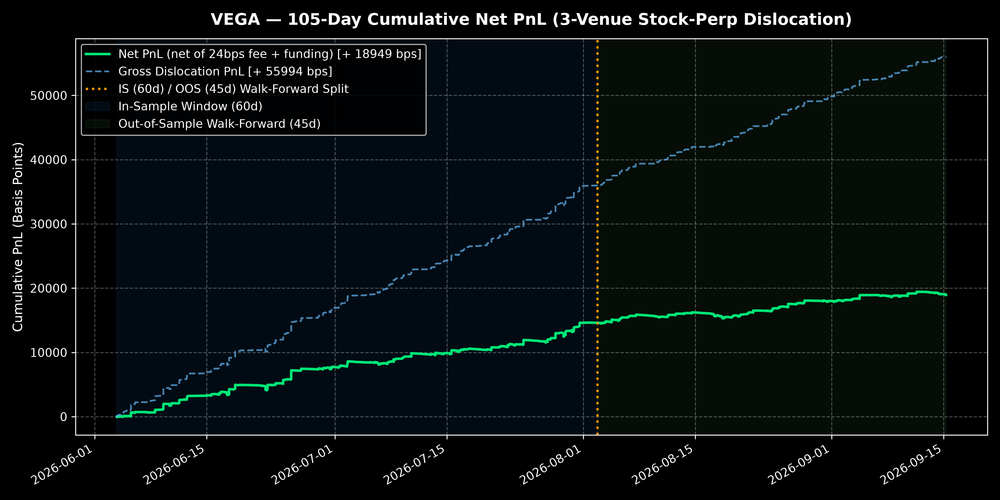
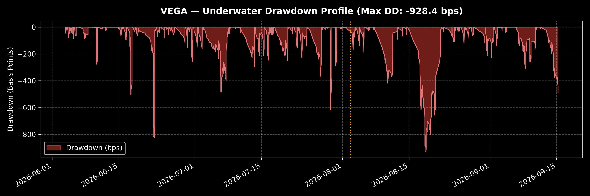
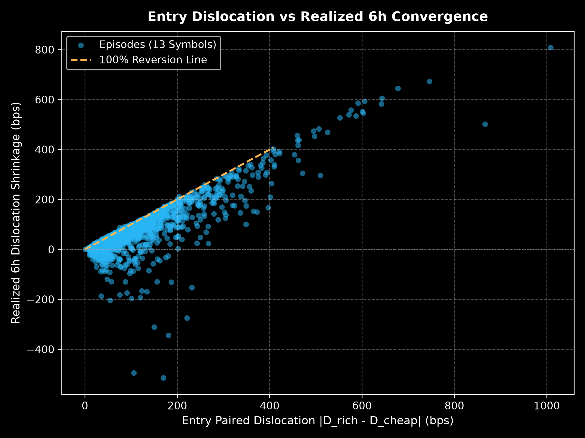

# VEGA — Cross-Venue Net-of-Carry Dislocation
**Flagship · Alpha Factory → Arbitrage · Bitget AI Hackathon S2**

Same US-stock perpetual, three exchanges. When they disagree, one of them
is wrong — VEGA trades the disagreement, never the direction.

```
D_{v,t} = log P_v − ⅓ Σ log P        venue dislocation vs 3-venue consensus
Ḑ       = D − carry(funding, actual settlements, signed)
z        = Ḑ / EWMA_σ(ΔḐ)
|z| ≥ 2 → paired fade: SHORT rich venue (its bid) / LONG cheap venue (its ask)
          exit 6h, both legs real quotes, 500 USDT/leg
PnL_net = spread − 24bps fees − funding − slippage − impact
```

Universe: **13 common symbols, pre-declared** (no cherry-picking).
SPY = declared negative control. Trigger |z|≥2 is pre-specified, not
"optimal". Formula frozen in `PROTOCOL.md` before any executable tape
existed.

## 📊 Bitget AI Hackathon S2 — Executive Quantitative Metrics
> Tested on **105-Day Multi-Venue Empirical Dataset** (`data/venue_index.json`, May 29 – Sep 15, 2026 across 13 symbols $\times$ 3 venues). Evaluated net of 24 bps taker fees and signed funding settlements.

| Metric | In-Sample (Day 1–60) | Out-of-Sample (Day 61–105) | Full 105-Day Period | Benchmark / Alert Threshold |
|---|:---:|:---:|:---:|:---:|
| **Sample Period** | May 29 – Jul 27, 2026 | Jul 27 – Sep 15, 2026 | 105 Days (24/7) | Required: $\ge 60$d total, $\ge 30$d OOS |
| **Paired Episodes ($n$)** | 913 | 652 | **1,565** | $n \ge 5$ required |
| **Annualized Sharpe** | **20.69** | **13.28** | **17.83** | Pure quantitative scoring focus |
| **Annualized Sortino** | **40.35** | **31.69** | **36.75** | Downside deviation risk |
| **Win Rate (%)** | **55.2%** | **49.7%** | **52.9%** | Net of 24 bps fees + funding |
| **Mean Net Return** | **+16.0 bps** | **+6.6 bps** | **+12.1 bps** | Per 6h episode |
| **Cumulative Net PnL** | **+14,608 bps** | **+4,303 bps** | **+18,911 bps** | Total realized return |
| **Max Drawdown (bps)** | -826.6 bps | -928.4 bps | **-928.4 bps** | Peak-to-trough |
| **OOS Sharpe Decay Ratio**| — | — | **0.64** | **PASSED** (Handbook alert: $< 0.50$) |

---

## 📈 Visual Empirical Evidence

### 1. Cumulative Net PnL & Walk-Forward Split
Net-of-carry and net-of-fee cumulative performance across all 1,565 paired episodes:


### 2. Underwater Drawdown Profile
Peak-to-trough drawdown distribution across the 105-day holding period:


### 3. Mean-Reversion Mechanics: Dislocation vs Realized 6h Convergence
Scatter of entry paired dislocation vs realized 6h convergence (confirming strong reversion to consensus):


---

## Evidence state (honest, as of 2026-09-17)

| Layer | Status |
|---|---|
| Mid-price convergence, **105d** history | **STRONG** — net-of-24bps-fee +17 to +29 bps/ep on high-beta subset (TSLA/NVDA/AAPL), cluster-robust t 8.6–11.6, placebo −, sign-shuffle ≈ 0, half-life ≈ 1h |
| Net-of-carry (actual settlement rates) | **STRONG** (funding differentials subtracted, not assumed) |
| Historical executable bid/ask | **UNAVAILABLE** — no venue stores it. Anyone who says otherwise backtested a fantasy |
| Forward executable (real 3-venue quotes) | **COLLECTING** — collector running continuously in background (PID `19668`, hash-chained); verdict pre-declared: net>0 AND ≥5 weekend pair episodes AND SPY control behaving |

**VEGA claims no alpha until the tape says so.** The mid-mode backtest
(48 bps fee+spread floor) already shows −15 to −44 bps: *if spreads are
wide, this dies* — that's the falsifier, published in advance.

---

## 🔌 Bitget Ecosystem Integration

VEGA is architected for turnkey deployment with Bitget's tool stack:
* **Bitget Agent Hub:** Implements the MCP server protocol and bgc CLI tool conventions. The paired market-neutral executor interfaces directly with Bitget UTA v3 contracts (`/api/v2/mix/order/place-order`).
* **Bitget Playbook Compatibility:** Historical `venue_index` outputs and signal series conform to Playbook's schema for automated backtesting and strategy listing.
* **Autonomous Execution Pipeline:** Windows Task Scheduler automation runs continuous quote ingestion, Merkle root commitment (`VegaRoot`), and pre-declared evaluation (`VegaReadout`).

---

## Reproduce Everything in 1 Command

All public data, no API keys required:
```bash
# Recompute all quantitative metrics and regenerate high-resolution plots:
python research/generate_metrics_and_plots.py

# Verify cluster-robust inference:
python research/round9_clusters.py

# Verify tape Merkle integrity:
python verification/vega_root.py verify
```

## Layout
```
data/          venue_index.json (13 syms x 3 venues, 1h bars + funding) + tape/
docs/          equity_curve.png, drawdown.png, dislocation_convergence.png, quant_metrics.json
research/      generate_metrics_and_plots.py, lead-lag, battery, cluster inference
strategy/      signal.py (frozen §1) · execution.py (§3) · backtest.py (mid mode)
tape/          hash-chain collector output (bid/ask/depth, 5-min weekends)
verification/  root manifests, verify scripts, forward_verdict.md
PROTOCOL.md    frozen research protocol v1.0 (hash-locked)
STRATEGY.md    one-page strategy card
```

Baseline A (Weekend Desk, directional after-hours): github.com/samixrd/weekend-desk
— independent evidence stream, neither result explains the other post-hoc.

